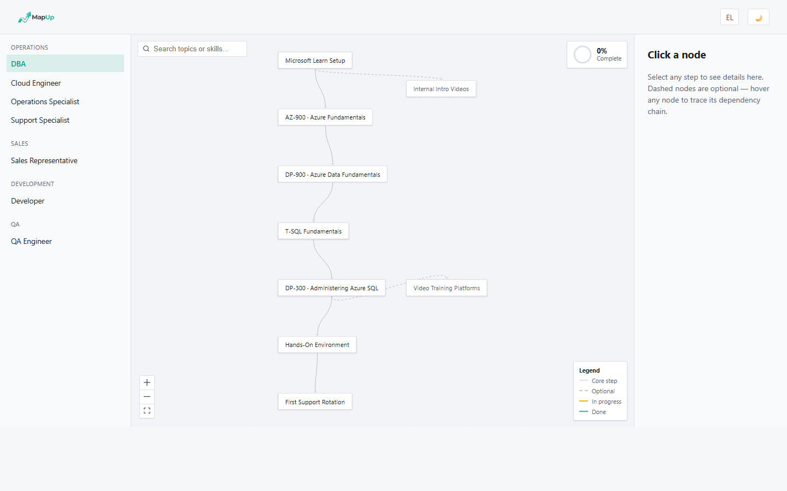
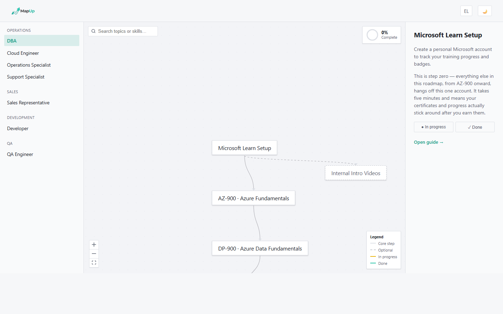
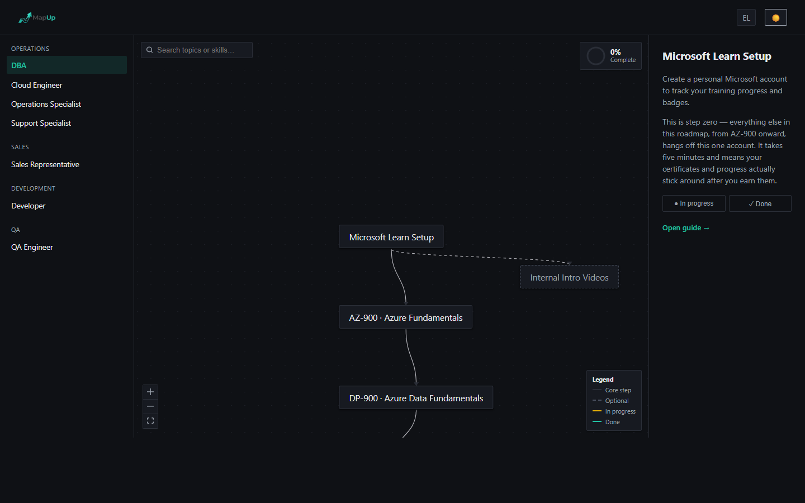

# MapUp

An interactive employee/department onboarding roadmap — not a coding-skills roadmap. Pick a department and role, and walk through an interactive path of onboarding steps, each with its own guide, skills, and progress tracking.

🔗 **Live site:** https://vlapozidis.github.io/MapUp/



## Features

- **Departments → Roles → Roadmaps** — pick a department in the sidebar, then a role, to load that role's onboarding path.
- **Interactive canvas** — a [React Flow](https://reactflow.dev/) graph of the role's steps, with optional/side-branch nodes shown dashed, a staggered "reveal" animation when a roadmap loads, and keyboard navigation (arrow keys to move between connected steps, <kbd>Esc</kbd> to deselect).
- **Node detail panel** — click any step to see its description, related skills, and a link to its written guide (when one exists).

  

- **Progress tracking** — mark steps in progress or done; a completion ring shows your percentage through the core (non-optional) path, with a small celebration when you hit 100%. Progress is saved per role in `localStorage`, with a "reset progress" + undo action.
- **Guides** — longer-form Markdown guides for individual steps (e.g. certification paths, tooling setup), rendered as their own pages and linked back to the roadmap.
- **Light/dark theme and English/Greek locale**, both toggleable from the header and persisted across visits.

  

## Tech stack

- [Astro](https://astro.build/) — static site framework and routing
- [React](https://react.dev/) (via `@astrojs/react`) — the interactive roadmap app
- [@xyflow/react](https://reactflow.dev/) — the node/edge canvas
- Plain CSS-in-JS (inline styles) — no CSS framework
- GitHub Actions → GitHub Pages — build and deploy

## Project structure

```
src/
├── pages/
│   ├── index.astro          # redirects to /roadmap
│   ├── roadmap.astro        # hosts <RoadmapApp client:load />
│   └── guides/[...slug].astro
├── components/
│   ├── RoadmapApp.tsx       # sidebar + canvas + detail panel shell; owns theme/locale state
│   └── RoadmapFlow.tsx      # the React Flow canvas for a single role
├── data/
│   ├── departments.ts       # department list
│   ├── roles.ts             # role list, grouped by department
│   ├── skillInfo.ts         # descriptions shown for each skill tag
│   └── roadmaps/            # per-role node/edge definitions (no display text)
│       ├── <role-id>.ts
│       └── index.ts
├── i18n/
│   ├── en.json              # all display text (labels, descriptions, UI strings)
│   └── el.json
├── content/
│   └── guides/
│       ├── en/<slug>.md     # guide content, one file per step
│       └── el/<slug>.md
└── lib/
    └── theme.ts              # shared theme color tokens
```

Roadmap **structure** (which nodes exist, how they connect) and **display text** (labels, descriptions) are intentionally split: `src/data/roadmaps/<role-id>.ts` defines nodes/edges only, and `src/i18n/{en,el}.json` holds the actual copy under `roadmap.<role-id>.nodes.<node-id>`. This keeps translations and content edits out of the graph-structure files.

## Adding a new role

1. Add the role to `src/data/roles.ts`, under the right department.
2. Create `src/data/roadmaps/<role-id>.ts` with its nodes and edges.
3. Register it in `src/data/roadmaps/index.ts`.
4. Add its i18n keys (`label`, `description` per node) to **both** `en.json` and `el.json`.
5. (Optional) Add guide content under `src/content/guides/{en,el}/<slug>.md` for any node that should link out to a full guide — set `guideSlug` on that node in step 2.

Roles with no real content yet can reuse `src/data/roadmaps/placeholder.ts` — the sidebar shows "Coming soon" for departments with no roles.

## Development

```sh
npm install
npm run dev          # http://localhost:4321
```

or, per this repo's convention, run the dev server in the background so it doesn't block your terminal:

```sh
npx astro dev --background
npx astro dev status
npx astro dev logs
npx astro dev stop
```

| Command | Action |
| :--- | :--- |
| `npm run dev` | Start the local dev server |
| `npm run build` | Build the production site to `./dist/` |
| `npm run preview` | Preview the production build locally |

**Gotcha:** after changing a content collection's glob pattern in `content.config.ts`, the dev server's content cache can get stuck reporting the collection as empty even after matching files are added — restart the dev server (`astro dev stop` then `astro dev --background`) to force a resync.

## Deployment

Every push to `main` triggers `.github/workflows/deploy.yml`, which builds the site with [`withastro/action`](https://github.com/withastro/action) and publishes it to GitHub Pages. `astro.config.mjs` sets `site`/`base` for the project's Pages URL — update `base` if the repository is ever renamed.

## Credentials policy

Never commit real shared-account credentials (passwords, API keys) into guide content or anywhere else in this repo — redact with a note like "shared separately by your onboarding contact."
